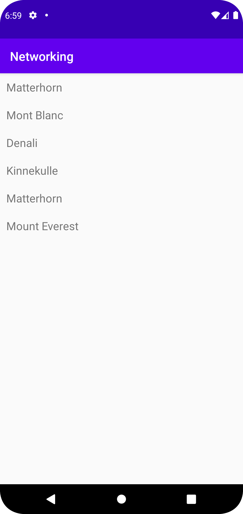

# Rapport
Set up all java classes and a layout file.
Added a recyclerview widget to the activity which displays objects in items arraylist.
Created the mountain class and added and the arraylist mountainList which contains mountains from json file.
Created a getJson method which gets the json data from the JSON_URL.
Created a for loop which adds all mountains from the json data and adds them to the items arraylist, displaying them in the recyclerview.

The following code displays the getJson method and the for loop which adds the data to the items arraylist.

```
    private void getJson() {
        new JsonTask(this).execute(JSON_URL);
        new JsonFile(this, this).execute(JSON_FILE);
    }
    
            for (Mountain mountain : mountainList) {
            items.add(new RecyclerViewItem(mountain.name));
        }
        adapter.notifyDataSetChanged();
    
```


